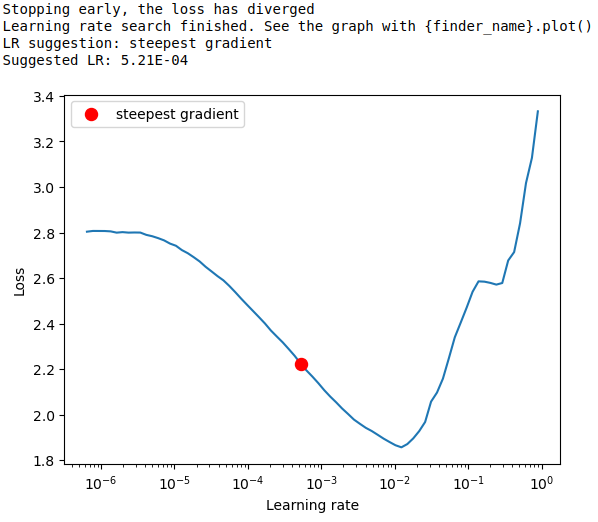
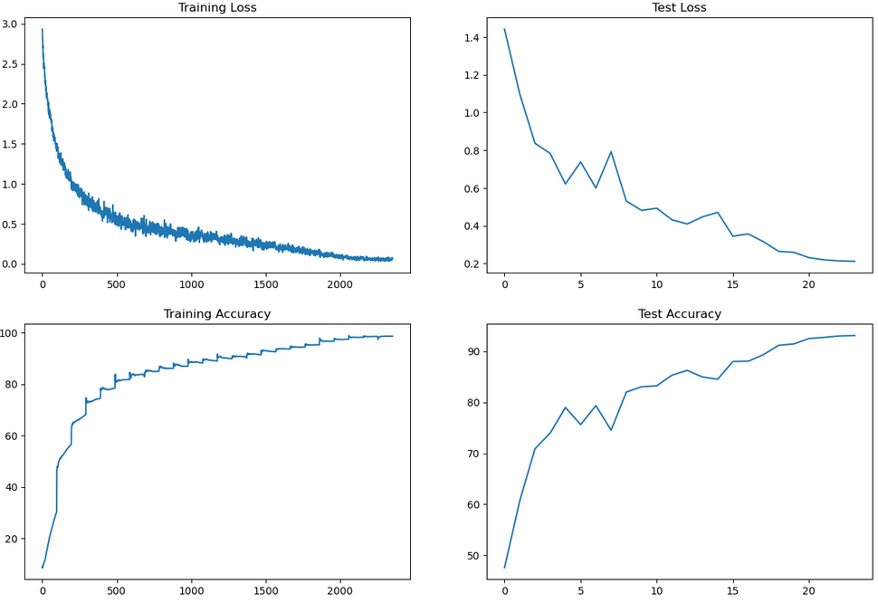
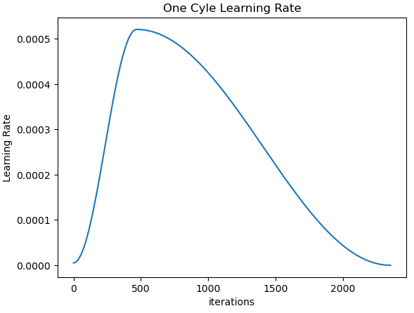
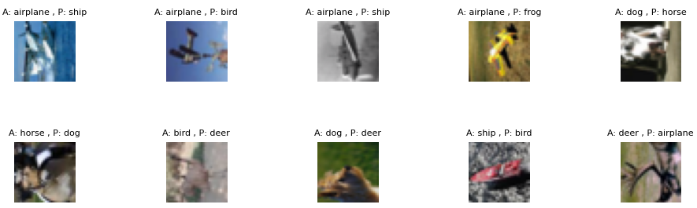

# ERA Session 10 Assignment

The aim of the assignment is to train a ResNet model on CIFAR10 dataset to achieve test accuracy of more than 90% from the 19th epoch with below given constraints.

    1. Write a ResNet architecture for CIFAR10 that has the following architecture: 
        1. PrepLayer - Conv 3x3 s1, p1) >> BN >> RELU [64k] 
        2. Layer1 - 
            1. X = Conv 3x3 (s1, p1) >> MaxPool2D >> BN >> RELU [128k] 
            2. R1 = ResBlock( (Conv-BN-ReLU-Conv-BN-ReLU))(X) [128k]  
            3. Add(X, R1) 
        3. Layer 2 - 
            1. Conv 3x3 [256k] 
            2. MaxPooling2D 
            3. BN 
            4. ReLU 
        4. Layer 3 - 
            1. X = Conv 3x3 (s1, p1) >> MaxPool2D >> BN >> RELU [512k] 
            2. R2 = ResBlock( (Conv-BN-ReLU-Conv-BN-ReLU))(X) [512k] 
            3. Add(X, R2) 
        5. MaxPooling with Kernel Size 4 
        6. FC Layer
        7. SoftMax 
    2. Uses One Cycle Policy such that: 
        1. Total Epochs = 24 
        2. Max at Epoch = 5 
        3. LRMIN = FIND 
        4. LRMAX = FIND 
        5. NO Annihilation 
    3. Uses this transform -RandomCrop 32, 32 (after padding of 4) >> FlipLR >> Followed by CutOut(8, 8) 
    4. Batch size = 512 
    5. Use ADAM, and CrossEntropyLoss 
    6. Target Accuracy: 90% 

## Pre-requisites

The code is written in Python 3.10.11. It is recommended to use a virtual environment to run the code to avoid dependency issues. Try to use Google Colab or Kaggle to run the code as they provide free access to GPUs. If you are running the code on your local machine, make sure you install the virtual environment before running the code.

### Installing the Virtual Environment

It is advised to install Anaconda to manage the virtual environment. Anaconda can be downloaded from [here](https://www.anaconda.com/products/individual). Once installed, the virtual environment can be created using the following command:

```bash
conda create -n era python=3.10.11
```

### Activating the Virtual Environment

The virtual environment needs to be activated before running the code. This can be done using the following command:

```bash
conda activate era
```

## Installation

1. Clone the repository using the following command:

    ```bash
    git clone https://github.com/ChikkaUdayaSai/ERA-S10-Assignment
    ```

2. Navigate to the repository directory:

    ```bash
    cd ERA-S10-Assignment
    ```

3. Install the dependencies using the following commnad:

    ```bash
    pip install -r requirements.txt
    ```

Note: If you are using Google Colab or Kaggle, you can skip the above step as the dependencies are already installed in the environment. But it is advised to check the versions of the dependencies before running the code.

The code uses PyTorch and Torchvision for fetching the MNIST dataset and training the model. An additional dependency, Matplotlib, is used for plotting the training and validation losses. Finally, the Torchsummary package is used to visualize the model architecture.

We are now ready to run the code with the following versions of the dependencies:

- **PyTorch: 2.0.1**
- **Torchvision: 0.15.2**
- **Matplotlib: 3.7.1**
- **Torchsummary: 1.5.1**
- **Albumentations: 1.2.1**


## Solution

In this we will use above given CNN architecture to achieve target test accuracy of more than 90% from the 19th epoch.

Following are the model parameter, train and test accuracies achieved in training the model for 24 epochs.
- Model Parameters - 6,573,130
- Train Accuracy - 98.60%
- Test Accuracy - 93.07%

The entire assignment was modularized into different python modules and the runner code is present in the Session9.ipynb notebook. The following modules were created:

1. model.py - Contains the model architecture
2. utils.py - Contains the helper functions
3. dataset.py - Contains the custom dataset class for loading the CIFAR10 dataset
4. train.py - Contains the training and testing functions

The blow graph shows LR finder to determine the optimum learning rate to use in one cycle LR policy.


The losses and accuracies for the training and test sets are as follows:


The below graph shows the one cycle LR policy used in the training.


The below image shows the misclassified images from the test set.

